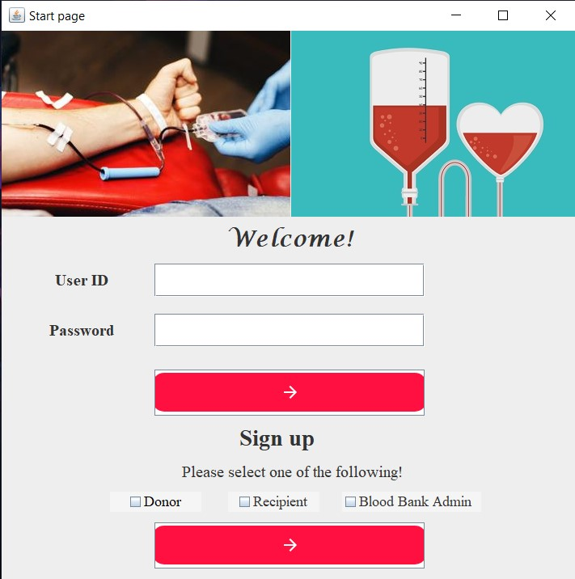
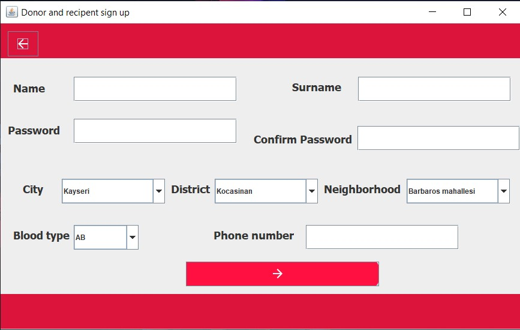
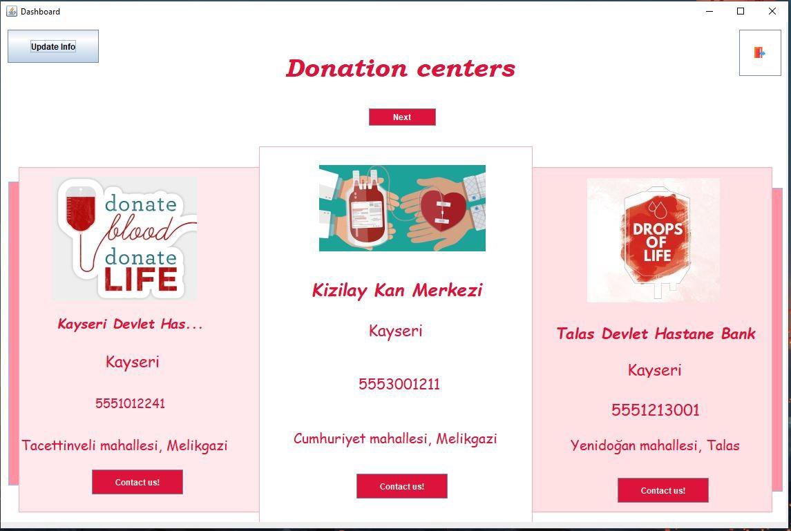
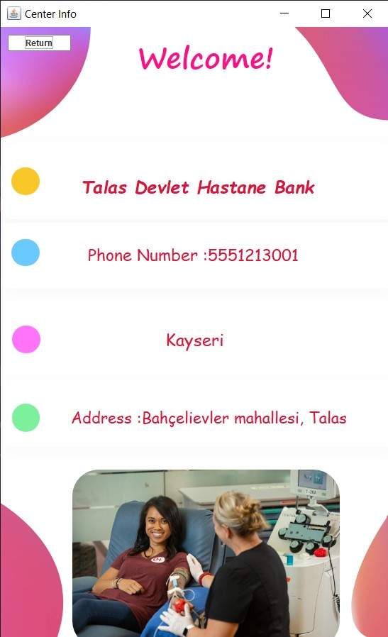
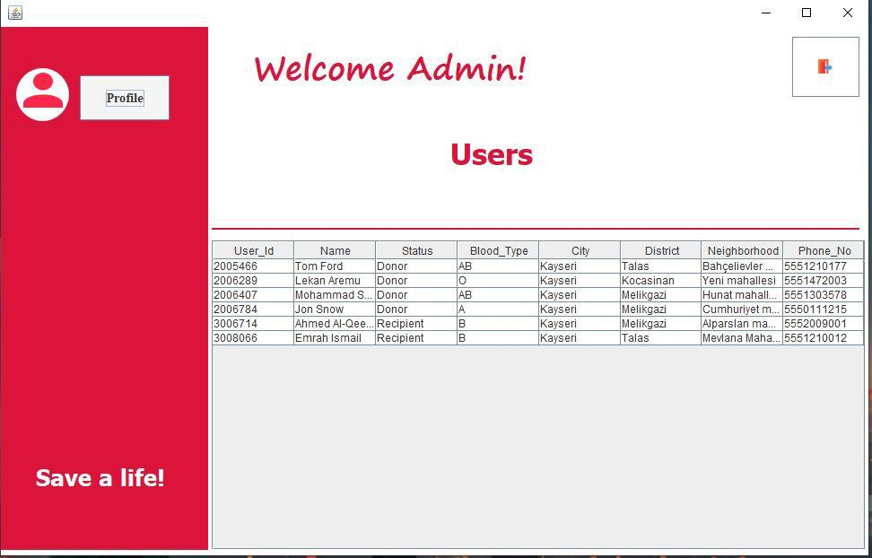
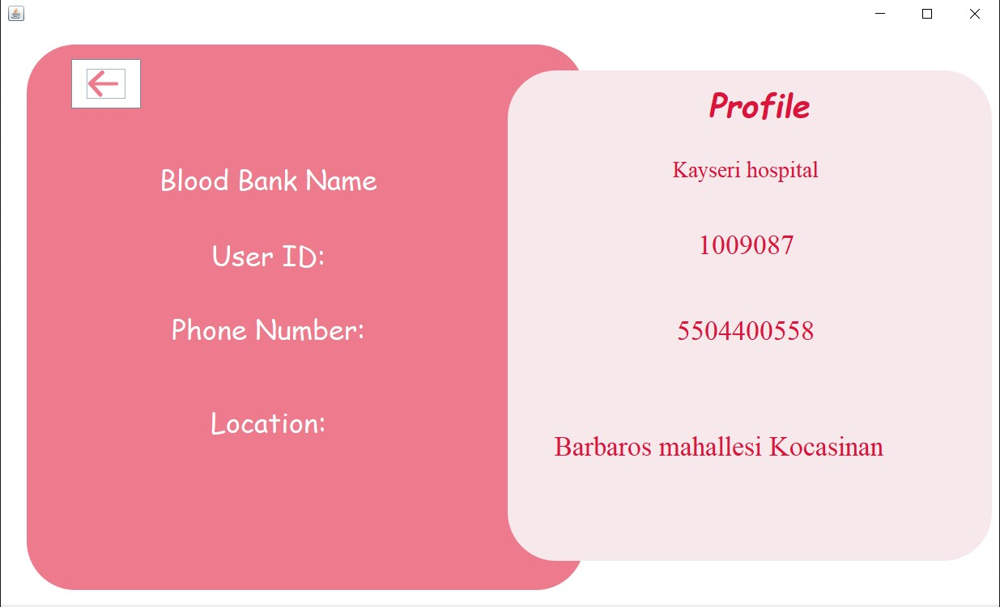

# Blood donation DBMS for COMP204 course 

# Project decription 📃

The software which we used to demonstrate the database was developed in Java, accompanied with the Java Database Connectivity (JDBC) for connection to the database and Swing for the graphical user interface (GUI). 
An external Jar file called ‘rs2xml’ for populating Jtables was used as well.

When the program is first run, the start page is displayed and it can be used to sign in or sign up.
If the user chooses to sign up, they would need to select what kind of user they would be signing up as from our three choices, 
- `The donor`
- `Recipient`
- `Blood bank`

and then click on the sign up button after which they will be transferred to the relevant sign up pages.
Alternatively, if the user is registered into the system, they can sign in by giving their user id and their password.

On the Donor or Recipient sign up page, they can enter their basic info and select their address and blood type from a combo-box with values populated from the Address and Blood Type tables of the database.
After the user enters all their valid information, the user clicks the sign-up button and are given an id with which they use to sign in. Donors are given an id that begins with 200, recipients are given an id that begins with 300 and blood banks are given an id that begins with 100. 

The blood-bank sign-up page is similar to this, with some minor changes to accommodate the data with which a blood bank needs to provide according to our database design philosophy.

After the user signs up, they can now sign in. If they are a donor or recipient, they will be redirected to the dashboard where all the blood banks in the system are displayed to them. They can click on the `next` button to see more blood-banks in the system if they are available and they can click on the `contact us` button to see the full information of the blood-bank. 

The update button sends the 27 user to the update page when clicked and then the user can update their data in the system. There is also a log-out button present at the top right of the page.

On the other hand, when a blood-bank user signs in, they are taken to the admin page where all the donors and recipients in the system are displayed on a table. The blood-bank user can click on the `profile` button to see their information as well.

# Team members 👨‍💻
- [Mohammad Shughri](https://github.com/MXS11)
- [Olamilekan Rasaq AREMU](https://github.com/Areezy)
# Project report 📑
- [Final report](https://drive.google.com/file/d/12fcKsY-g5QpwEGohX-1LEY_gvkocbpoz/view?usp=sharing)
# Screenshots 📸

